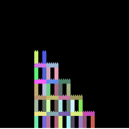
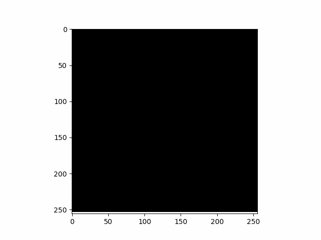

# AbstractBeam: Enhancing Bottom-Up Program Synthesis Using Library Learning


## Abstract
LambdaBeam is an execution-guided algorithm for program synthesis that efficiently generates programs using higher-order functions, lambda functions, and iterative loops within a Domain-Specific Language (DSL). However, it does not capitalize on recurring program blocks commonly found in domains like list traversal. 

To address this, *AbstractBeam* introduces *Library Learning*, which identifies and integrates recurring program structures into the DSL, optimizing the synthesis process. Experimental results show that AbstractBeam significantly outperforms LambdaBeam in terms of task completion and efficiency, reducing the number of candidate programs and the time required for synthesis. Library Learning proves beneficial even in domains not explicitly designed for it, demonstrating its broad applicability.

Together, these advancements showcase how AbstractBeam leverages Library Learning to improve upon traditional synthesis methods, balancing the strengths of execution-guided search and reusable code abstractions.


This repository contains the source code associated with this [preprint](https://arxiv.org/abs/2405.17514):

In this research project, we aim to reduce the search space blowup in Program Synthesis. For this purpose, we train a neural model to learn a search
policy for bottom-up execution-guided program synthesis and extend it using DSL Enhancement.


## Code
### Setup
Make sure to install pytorch and pytorch-scatter.
We used torch==2.2.1 and torch-scatter==2.1.2 and python=3.8.19.
Then install the packages in the requirements file, e.g.:
```
pip install -r requirements.txt
```
### File structure

The synthetic training data is saved to  `./neurips/abstractbeam/data` and  `./neurips/lambdabeam/data`.
Make sure to also create `./neurips/abstractbeam/models` and `./neurips/abstractbeam/results` directories. Same goes when you want to train the LambdaBeam benchmark.

### Train or eval the model
Navigate to `crossbeam/experiment/deepcoder` directory, and select the config you want to run.
Just adapt the config path to point to `./crossbeam/experiment/deepcoder/configs/` + [`train/abstractbeam.py`, `train/baseline.py`, `eval/abstractbeam_eval.py`, `eval/lambdabeam_eval.py`].
You can make any necessary edits to the selected config file including the data, model, and result directories.
Moreover, you can adapt the hyperparameters, e.g., the enumeration timeout, number of GPUs to use, ... .
To start run below from the project's root (the number of GPUs set in the config file must align with the number selected in below script):

```
./crossbeam/experiment/deepcoder/run_deepcoder.sh
```

