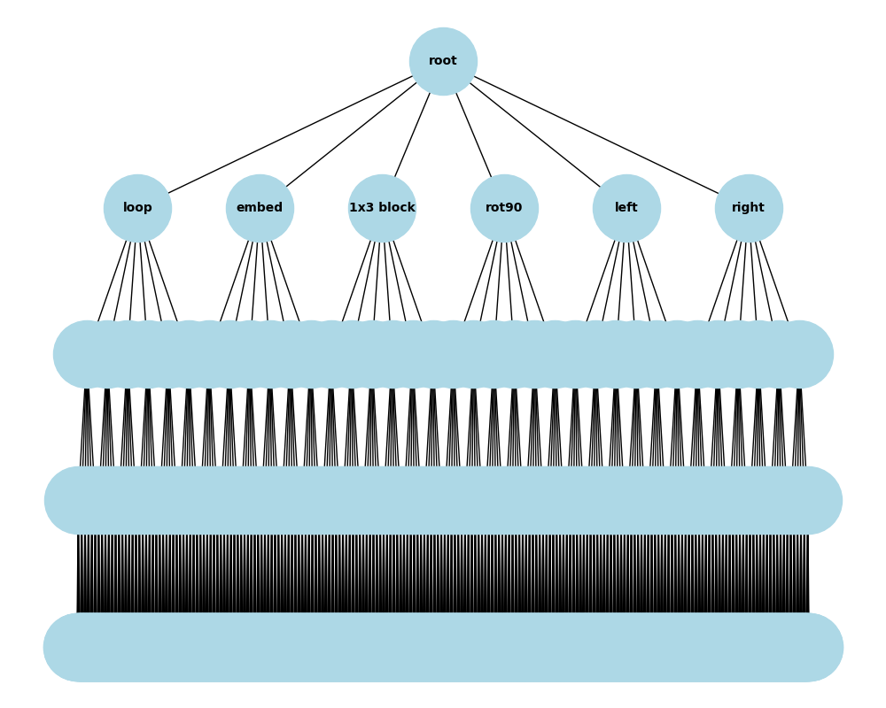
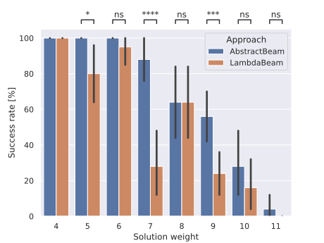
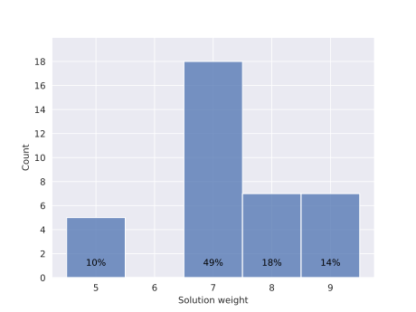
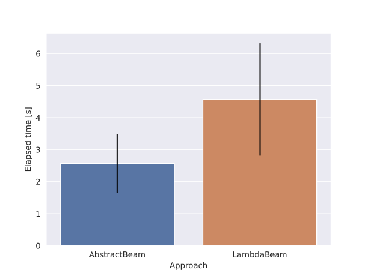

# AbstractBeam: Enhancing Bottom-Up Program Synthesis using Library Learning

<a href="https://arxiv.org/abs/2405.17514" class="button">&#128214; Full Paper</a>
<a href="https://github.com/jzenkner/AbstractBeam" class="button" >&#128190; Github Repo</a>

<table align="center">
  <tr>
    <!-- Target Image Column -->
    <td style="height:30%; width:30%;" align="center"> 
      
      
Target

    </td>
    <!-- Generated Construction Program -->
    <td style="height:30%; width:30%; overflow:auto;"> 
      <pre lang="lisp" style="white-space: pre-wrap;">
(lambda (loopM 6 (lambda (lambda (loopM $1 
(lambda (lambda (embedTower (lambda (1x3 
(right 4 (1x3 (left 2 (3x1 $0)))))) $0)))
(left 6 $0)))) $0))
      </pre>
      
Generated Construction Program

    </td>
    <!-- Animation of Construction Process -->
    <td style="height:30%; width:30%;" align="center"> 
      
      
Animation of Construction Process

    </td>
  </tr>
</table>

## Abstract
LambdaBeam is an execution-guided algorithm for program synthesis that efficiently generates programs using higher-order functions, lambda functions, and iterative loops within a Domain-Specific Language (DSL). However, it does not capitalize on recurring program blocks. 

To address this, *AbstractBeam* introduces *Library Learning*, which identifies and integrates recurring program structures into the DSL, optimizing the synthesis process. Experimental results show that AbstractBeam significantly outperforms LambdaBeam in terms of task completion and efficiency, reducing the number of candidate programs and the time required for synthesis. Moreover, Library Learning proves beneficial even in domains not explicitly designed for it, demonstrating its broad applicability.

Together, these advancements showcase how AbstractBeam leverages Library Learning to improve upon traditional synthesis methods, balancing the strengths of execution-guided search and reusable code abstractions.

## List Manipulations
<table align="center">
  <tr>
    <td style="height:30%;  width:30%;" align="center"> 
      
      
Exemplary Tasks of the List domain

    </td>
  </tr>
</table>
The list manipulation domain on which AbstractBeam was evaluated consists of a set of programming tasks focused on processing and transforming lists of integers. These tasks, commonly encountered in functional programming, involve operations such as filtering, mapping, and folding elements of a list based on specific criteria. For instance, tasks may require the generation of programs that double all even numbers in a list, filter out odd numbers, or compute aggregate values like sums or counts based on conditions. The complexity of these tasks grows with the introduction of loops, conditional statements, and higher-order functions. 

## Motivation
<table align="center">
  <tr>
    <td style="height:30%;  width:30%;" align="center"> 
      
      
Search Tree with depth=4

    </td>
  </tr>
</table>
A major challenge in program synthesis is the **exploding search space**, which grows exponentially as the size of the DSL or the length of the programs increases. When synthesizing programs, each additional operation or program block adds to the depth and breadth of the search tree, causing a combinatorial explosion. For example, in a large DSL with many available operations, the number of possible combinations of these operations becomes unmanageable, particularly as the program length grows. This makes it increasingly difficult to find correct programs within a reasonable amount of time. The trial-and-error approach to testing every combination becomes impractical for complex tasks, leading to a bottleneck in the efficiency and scalability of traditional synthesis methods. Optimizing the search process, such as through techniques like Library Learning in AbstractBeam, is crucial for reducing the search depth by identifying reusable components and narrowing down the number of candidate programs, making synthesis feasible even in more extensive DSLs or longer programs.

## Results
<table align="center">
  <tr>
    <td style="height:30%;  width:30%;" align="center"> 
      
      

    </td>
    <td style="height:30%;  width:30%;" align="center"> 
      
      

    </td>
    <td style="height:30%;  width:30%;" align="center"> 
      
      

    </td>
  </tr>
</table>

LambdaBeam solved 50.2% ± 2.0% of handwritten test tasks on the first fold and 36.0% ± 2.5% on the second fold. AbstractBeam did better, with success rates of 53.6% ± 2.3% and 39.6% ± 1.5% on the first and second folds, respectively, showing a statistically significant improvement (p < 0.05). This supports the idea that Library Learning helps LambdaBeam perform better, especially on tasks that involve abstractions. Interestingly, the performance difference between the two methods was only noticeable when program solutions used abstractions. When there weren’t any or only a few abstractions, both methods performed similarly.

On the efficiency side, AbstractBeam was faster. It took an average of 2.57 seconds ± 5.58 seconds to solve tasks, while LambdaBeam needed 4.57 seconds ± 7.07 seconds. This speed boost comes from AbstractBeam's ability to reduce the search space by using abstractions, which not only helped it solve more tasks but also required less time and fewer candidate programs. Even though both methods had the same timeout, AbstractBeam still processed fewer programs because the abstractions made its search process more efficient. However, there’s a balance to be struck — adding too many unused abstractions to the DSL can bloat it and cancel out the benefits. So, managing the DSL thoughtfully is key to keeping the performance gains intact.

